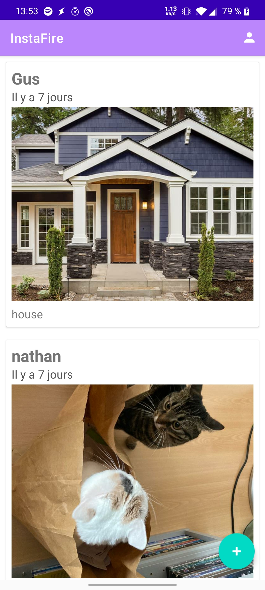

# Instafire

   

## Description

This app is the result of the really nice tutorial from Rahul Pandei. <a href="https://bit.ly/2ZNJlF4">Youtube Tutorial</a>

## Technologies used

- Kotlin
- Firestore
- SwipeRefreshLayout
- Glide
